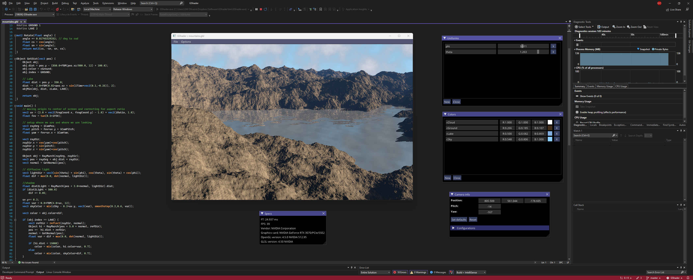
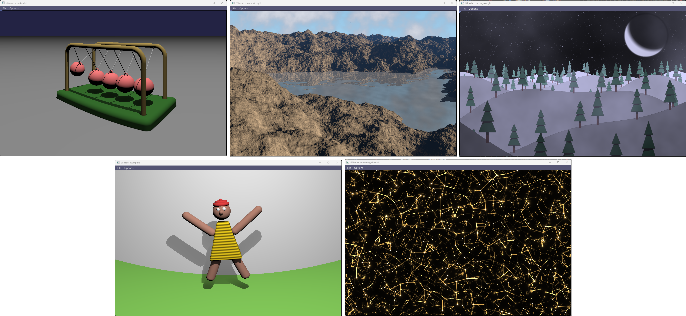

<!-- PROJECT LOGO -->
<h1 align="center">GShader</h1>


<p align="center">
GShader is a small utility program for hobbyists that love to use maths to create art using GLSL shading language. 
</p>

<!-- TABLE OF CONTENTS -->
<details open="open">
  <summary>Table of Contents</summary>
  <ol>
    <li><a href="#examples">Examples</a></li>
    <li><a href="#getting-started">Getting Started</a></li>
    <li><a href="#license">License</a></li>
  </ol>
</details>

<!-- EXAMPLES -->
## Examples
A good way to learn how to write shaders is following these two youtube channels, from which I much learned:

- https://www.youtube.com/c/TheArtofCodeIsCool
- https://www.youtube.com/c/InigoQuilez


A few examples are included with this project. Simply open the configuration json file to pre-load all used colors, uniforms and camera properties. For simpler shaders, just open the glsl file directly.



<br/>

<!-- GETTING STARTED -->
## Getting Started

### Source code

```
git clone --recurse https://github.com/guilmont/GShader.git
```

### Binary
GShader is a single executable file. Under bin you can find an executable for Windows and Linux, but they might not be the most up-to-date version or compiled in Release mode.

### Installation with CMake
This project uses CMake as its building system. Hence, the traditional way to install it is to open a terminal in cloned location and do the following

  ```
  mkdir build
  cd build

  (Windows) -> cmake .. -DCMAKE_INSTALL_PREFIX="path_to_desired_location"
  (Windows) -> cmake --build . --config Release --target install -j8

  (Linux) -> cmake .. -DCMAKE_BUILD_TYPE=Release -DCMAKE_INSTALL_PREFIX="path_to_desired_location"
  (Linux) -> make install -j8
  ```

### VS 2022 ::  VSCode + Ninja
This project presents a CMakePresets which allows you to configure GShader and build it using your favorite tool. Load the cloned folder with either, choose you build configuration and press play.

<br/>

<!-- LICENSE -->
## License

Distributed under the MIT license. See `License.txt` for more information.

<br/>

---

Copyright 2022 Guilherme MONTEIRO OLIVEIRA
